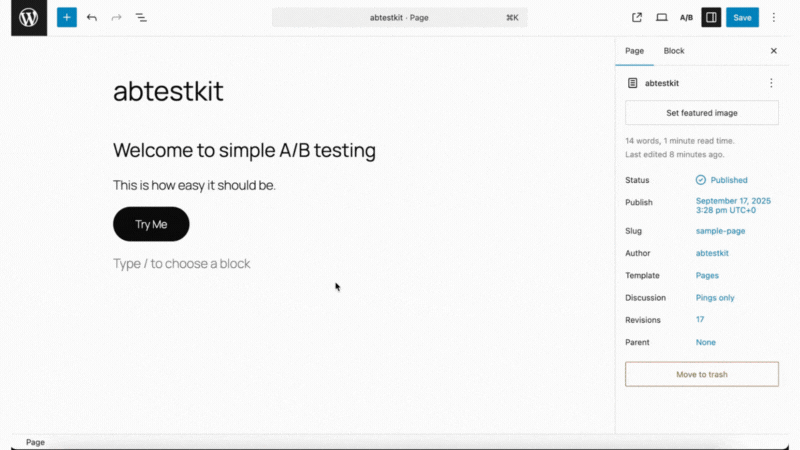

# abtestkit
**Simple, in-editor testing for WordPress Core Editor (Gutenberg).**  
No dashboards. Just click a block, open the sidebar, add Variant B, and wait for a winner.



---

## What it does
Run lightweight A/B tests directly on Gutenberg,
automatically evaluates performance and shows you the winner.

- **Supported blocks:** core Button, Heading, Paragraph, Images
- **Inline editing UI:** toggle A/B testing from the block sidebar
- **Group tests:** keep multiple blocks (e.g., hero heading + paragraph + button) in sync as A/A or B/B
- **Frontend runtime:** impressions & clicks tracked via a tiny JS script (no external CDN)
- **Evaluation & winner:** automatically evaluates and declares winner using Bayesian evaluation. Stale & inconclusive tests are also declared
- **Respect existing markup:** preserves button attributes (e.g., Popup Maker), only touches what it must
- **Privacy-first telemetry:** opt-in only (anonymous + minimal if enabled)

---

## Quick start (1 minute)

1. **Install**
   - Download the ZIP from Releases (or clone the repo)  
   - WordPress Admin → Plugins → Add New → Upload → Install → Activate

2. **Pick a block**  
   Select a **Heading**, **Paragraph**, **Image**, or a **Button** block in the editor.

3. **Click A/B icon**  
   In the top right of wordpress editor, click the A/B icon to open the abtestkit sidebar.

4. **Enable A/B test**  
   In the plugin sidebar, toggle **Enable A/B test**.  
   Variant **A** auto-fills from the block’s current content; you add **Variant B**.

5. **(Optional) Group blocks**  
   Turn on **Group sync** and connect the same group code to force A/A or B/B across multiple blocks.

6. **Go!**  
   Hit **Start** (Go). Publish/Update the post. Traffic is split and tracked.

7. **See results**  
   The sidebar shows impressions/clicks and declares a winner when confident — or flags the test as **stale**.

---

## Requirements
- WordPress **6.3+** (Block Editor / Gutenberg)
- PHP **7.4+** (8.x recommended)
- Permalinks enabled (for REST API routes)

---

## How it works

- On the **frontend**, the plugin outputs a wrapper with `data-ab-test-id` and two hidden children:
  - Example: a button renders two `<span data-ab-variant="A|B">` labels; JS shows one variant per visitor.
- **Tracking**: a lightweight script sends `impression` and `click` events to `wp-json/ab-test/v1/track`.
- **Evaluation**: `/evaluate` uses a Bayesian model (Beta prior) to compute `probA`/`probB` and confidence.
- **Groups**: any blocks sharing a **group code** stay consistent (A for all, or B for all) using `localStorage` + a cookie.

---

## Supported blocks
- `core/heading` – variant text  
- `core/paragraph` – variant text  
- `core/button` – variant label (+ optional per-variant URL)  
- `core/image` – variant image URL/alt  

---

## Group testing (A/A or B/B across multiple blocks)
- Toggle **Group sync** inside the block sidebar and set the **same Group Code** on each block you want synced.
- abtestkit chooses one variant per group and applies it everywhere in that group (and remembers it per visitor).

---

## Security
Events are accepted only if **any** of these are true:
- Valid **WP REST nonce** (logged-in editors), **or**
- **Same-origin** request (browser), **or**
- Valid **HMAC** signature (server-side fallback) containing `postId` + short-lived timestamp.

Small per-minute rate limit prevents noise bursts.

---

## Data & database
On activation, abtestkit creates a small table for raw events:

```sql
-- wp_ab_test_events
-- id (PK), time (datetime),
-- post_id (bigint),
-- ab_test_id (varchar 64),
-- variant (char 1),              -- 'A' or 'B'
-- event_type enum(               -- 'impression','click','decision','decision_applied','stale'
-- ip (varchar 45),
-- user_agent (text)
```

The **Stats API** aggregates counts on the fly — no cron required.

---

## REST API (editor-only endpoints require nonce & capability)

- `POST /wp-json/ab-test/v1/track`  
  Payload: `{ type, postId, index, abTestId, variant, ts?, sig? }`

- `GET  /wp-json/ab-test/v1/stats?post_id=123&abTestId=ab-...`  
  or `&abTestIds=ab-1,ab-2,ab-3`

- `GET  /wp-json/ab-test/v1/evaluate?post_id=123&abTestId=ab-...`  
  → `{ probA, probB, ciLower, ciUpper, winner? }`

- `POST /wp-json/ab-test/v1/reset`  
  Body: `{ post_id, abTestId }`

- `POST /wp-json/ab-test/v1/telemetry` *(editor only, if opted in)*  
  Body: `{ event: 'first_toggle_enabled' | 'first_test_launched' | 'first_test_finished' | 'winner_applied', payload: {} }`

---

## Telemetry & email capture (optional)
- **Telemetry is opt-in only.** Admins see a one-time prompt; if accepted, the plugin sends minimal anonymous events
  (e.g., “first test launched”).
- A small **email prompt** can appear *after your first test launch* (one-time).  

To disable globally:

```php
// wp-config.php or plugin bootstrap
define('ABTEST_EMAIL_CAPTURE_ENABLED', false);
```

Both telemetry and email use the same configurable Apps Script URL by default.

If you wish to opt-out retrospectively. Please email abtestkit@gmail.com

---

## Installing from source

```bash
git clone https://github.com/abtestkit/abtestkit.git
cd abtestkit
# Vanilla PHP + JS; no build step required.
# Zip the folder or copy into wp-content/plugins/abtestkit
```

---

## Deactivation & Uninstall behavior

- **Deactivate:** clears rate-limit transients and best-effort flushes caches.  
- **Uninstall:**
  - Drops `wp_ab_test_events`
  - Removes any `_ab_test_variants` post meta
  - Strips A/B attributes from saved block content so pages render like normal Gutenberg again
  - Flushes common caches (Object Cache, W3TC, Rocket, LiteSpeed, etc.)

No A/B UI or switching remains once the plugin is removed.

---

## Troubleshooting

**No stats show up**  
View the **published page** (not the editor), confirm the frontend script loads, and that the browser isn’t blocking same-origin requests. Try a private window.

**My popup button stopped opening a popup**  
abtestkit preserves existing button attributes and only updates text/URL if set. If you specify per-variant URLs, make sure they’re valid (not `javascript:`).

**Group didn’t sync**  
Ensure **Group sync** is enabled on each block and all share the **exact** same group code.

---

## Roadmap
- More block types (Cover, Media & Text, List, Nav)
- WooCommerce conversions (order/revenue attribution)
- Per-post dashboard + CSV export

---

## Contributing
Issues and product requests welcome!  
Open an Issue with steps to reproduce and (if possible) a URL we can test.
Optionally, you can email abtestkit@gmail.com

---

## License
This project is licensed under the GPL-3.0 (see`LICENSE`).
